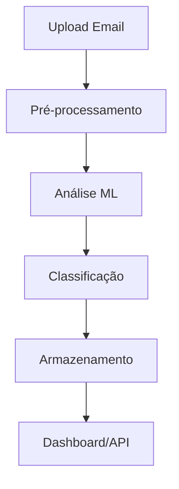

# AutoU Email Classifier 📧🤖

> Sistema inteligente de classificação automática de emails usando Machine Learning e Django REST Framework

[](https://python.org)
[](https://djangoproject.com)
[](https://docker.com)
[](https://www.django-rest-framework.org)
[](LICENSE)

## 📋 Índice

- [Sobre o Projeto](#sobre-o-projeto)
- [Funcionalidades](#funcionalidades)
- [Arquitetura](#arquitetura)
- [Tecnologias](#tecnologias)
- [Instalação](#instalação)
- [Docker](#docker)
- [API Documentation](#api-documentation)
- [Estrutura do Projeto](#estrutura-do-projeto)
- [Como Usar](#como-usar)
- [Contribuição](#contribuição)

## 🎯 Sobre o Projeto

O **AutoU Email Classifier** é uma aplicação web avançada que utiliza algoritmos de Machine Learning para classificar automaticamente emails em categorias como produtivos, improdutivos ou neutros. O sistema oferece uma interface web intuitiva e uma API REST completa para integração com outras aplicações.

### 🎪 Demo

```bash
# Acesse a aplicação localmente
http://localhost:8000/

# Principais endpoints
📊 Dashboard: /dashboard/
📤 Upload:    /upload/
🔧 Admin:     /admin/
📖 API Docs:  /api/docs/
```

## ⚡ Funcionalidades

### 🔮 Classificação Inteligente
- **Machine Learning** avançado para análise de conteúdo
- **Classificação automática** em tempo real
- **Score de confiança** para cada classificação
- **Reasoning explicativo** do resultado

### 📊 Dashboard Analítico
- **Estatísticas detalhadas** de classificações
- **Gráficos interativos** de distribuição
- **Histórico completo** de emails processados
- **Métricas de performance** do sistema

### 🚀 API REST Completa
- **Endpoints RESTful** bem documentados
- **Autenticação** e autorização
- **Documentação interativa** com Swagger
- **Versionamento** de API

### 📤 Upload e Processamento
- **Upload de arquivos** de email
- **Processamento em lote** (batch)
- **Validação** de formato e conteúdo
- **Feedback em tempo real**

## 🏗️ Arquitetura

### 📦 Arquitetura Modular

```
AutoU Email Classifier
├── 🎛️ Core (Configurações)
├── 📧 Apps.Emails (Gerenciamento)
├── 🤖 Apps.Classifier (IA/ML)
├── 🎨 Apps.Frontend (Interface)
└── 📡 API REST (Integração)
```

### 🔄 Fluxo de Dados



### 🎯 Padrões Arquiteturais

- **MVT (Model-View-Template)** - Django padrão
- **REST API** - Comunicação stateless
- **Separation of Concerns** - Apps modulares
- **DRY (Don't Repeat Yourself)** - Reutilização de código

## 🛠️ Tecnologias

### 💻 Backend
- **Python 3.11+** - Linguagem principal
- **Django 5.2.5** - Framework web robusto
- **Django REST Framework** - API REST poderosa
- **SQLite/PostgreSQL** - Banco de dados

### 🤖 Machine Learning
- **Scikit-learn** - Algoritmos de ML
- **Pandas** - Manipulação de dados
- **NumPy** - Computação numérica

### 🎨 Frontend
- **HTML5/CSS3** - Interface moderna
- **JavaScript** - Interatividade
- **Bootstrap** - Design responsivo

### 🐳 DevOps
- **Docker** - Containerização
- **Docker Compose** - Orquestração
- **Gunicorn** - Servidor WSGI
- **WhiteNoise** - Arquivos estáticos

### 📚 Documentação
- **drf-spectacular** - API docs automática
- **Swagger UI** - Interface interativa

## 🚀 Instalação

### 📋 Pré-requisitos

- Python 3.11+
- Docker & Docker Compose
- Git

### 🔧 Instalação Local

```bash
# 1. Clonar repositório
git clone https://github.com/seu-usuario/autou-email-classifier.git
cd autou-email-classifier

# 2. Criar ambiente virtual
python -m venv venv
source venv/bin/activate  # Linux/Mac
# venv\Scripts\activate   # Windows

# 3. Instalar dependências
pip install -r requirements.txt

# 4. Configurar banco de dados
python manage.py migrate

# 5. Criar superuser
python manage.py createsuperuser

# 6. Executar servidor
python manage.py runserver
```

## 🐳 Docker

### 🚀 Deploy Rápido

```bash
# Build e execução
docker compose up --build -d

# Verificar status
docker compose ps

# Ver logs
docker compose logs -f web
```

### 🔧 Comandos Úteis

```bash
# Executar migrações
docker compose exec web python manage.py migrate

# Criar superuser
docker compose exec web python manage.py createsuperuser

# Acessar shell
docker compose exec web python manage.py shell

# Parar aplicação
docker compose down
```

### ⚙️ Configuração Docker

```yaml
# docker-compose.yml
version: '3.8'
services:
  web:
    build: .
    ports:
      - "8000:8000"
    volumes:
      - .:/app
    environment:
      - DJANGO_SETTINGS_MODULE=core.settings.docker
```

## 📖 API Documentation

### 🔗 Endpoints Principais

```http
# Listar emails
GET /api/emails/

# Criar email
POST /api/emails/

# Classificar email
POST /api/emails/{id}/classify/

# Estatísticas
GET /api/stats/

# Upload arquivo
POST /api/upload/
```

### 📝 Exemplo de Uso

```python
import requests

# Classificar email
response = requests.post('http://localhost:8000/api/emails/', {
    'subject': 'Reunião importante',
    'content': 'Precisamos discutir o projeto...',
    'sender': 'manager@empresa.com'
})

print(response.json())
# {
#   "id": 1,
#   "classification_result": "productive",
#   "confidence_score": 0.92,
#   "reasoning": "Email relacionado ao trabalho"
# }
```

### 📊 Documentação Interativa

- **Swagger UI**: http://localhost:8000/api/docs/
- **ReDoc**: http://localhost:8000/api/redoc/
- **Schema JSON**: http://localhost:8000/api/schema/

## 📁 Estrutura do Projeto

```
autou-email-classifier/
├── 🏗️ core/                    # Configurações principais
│   ├── settings/
│   │   ├── base.py            # Configurações base
│   │   ├── development.py     # Desenvolvimento
│   │   ├── production.py      # Produção
│   │   └── docker.py          # Docker
│   ├── urls.py                # URLs principais
│   └── wsgi.py                # WSGI config
├── 📧 apps/
│   ├── emails/                # Gerenciamento de emails
│   │   ├── models.py          # Modelos de dados
│   │   ├── views.py           # Views/Controllers
│   │   ├── serializers.py     # Serialização API
│   │   └── urls.py            # URLs da app
│   ├── classifier/            # Sistema de classificação
│   │   ├── models.py          # Modelos ML
│   │   ├── services.py        # Lógica de negócio
│   │   ├── ml_models.py       # Algoritmos ML
│   │   └── views.py           # API views
│   └── frontend/              # Interface web
│       ├── views.py           # Views do frontend
│       ├── templates/         # Templates HTML
│       └── static/            # CSS, JS, imagens
├── 📄 templates/              # Templates globais
├── 📦 static/                 # Arquivos estáticos
├── 🐳 Dockerfile             # Imagem Docker
├── 🐳 docker-compose.yml     # Orquestração
├── 📋 requirements.txt       # Dependências Python
├── 🚀 deploy.sh             # Script de deploy
└── 📖 README.md             # Este arquivo
```

## 💡 Como Usar

### 1. 📤 Upload de Emails

```bash
# Via interface web
1. Acesse http://localhost:8000/upload/
2. Selecione arquivo ou cole conteúdo
3. Clique em "Classificar"

# Via API
curl -X POST http://localhost:8000/api/emails/ \
  -H "Content-Type: application/json" \
  -d '{
    "subject": "Seu assunto aqui",
    "content": "Conteúdo do email...",
    "sender": "email@exemplo.com"
  }'
```

### 2. 📊 Visualizar Dashboard

```bash
# Acesse o dashboard
http://localhost:8000/dashboard/

# Funcionalidades:
- 📈 Gráficos de distribuição
- 📊 Estatísticas em tempo real
- 📋 Lista de emails classificados
- 🔍 Filtros avançados
```

### 3. 🔧 Administração

```bash
# Acesse área administrativa
http://localhost:8000/admin/

# Login: admin / admin123
# Funcionalidades:
- 👥 Gerenciar usuários
- 📧 Administrar emails
- ⚙️ Configurações do sistema
```

## 🤝 Contribuição

### 🛠️ Como Contribuir

1. **Fork** o projeto
2. **Crie** uma branch (`git checkout -b feature/nova-funcionalidade`)
3. **Commit** suas mudanças (`git commit -m 'Adiciona nova funcionalidade'`)
4. **Push** para a branch (`git push origin feature/nova-funcionalidade`)
5. **Abra** um Pull Request

### 📝 Diretrizes

- Siga o padrão **PEP 8** para Python
- Adicione **testes** para novas funcionalidades
- Atualize a **documentação** quando necessário
- Use **commits semânticos**

### 🧪 Executar Testes

```bash
# Testes locais
python manage.py test

# Testes com Docker
docker compose exec web python manage.py test

# Coverage
pip install coverage
coverage run manage.py test
coverage report
```

## 📊 Roadmap

### 🎯 Versão 2.0
- [ ] **Integração com GPT** para análise avançada
- [ ] **API GraphQL** como alternativa ao REST
- [ ] **Dashboard em tempo real** com WebSockets
- [ ] **Sistema de plugins** para extensibilidade

### 🎯 Versão 2.1
- [ ] **Machine Learning** mais avançado
- [ ] **Detecção de spam** aprimorada
- [ ] **Análise de sentimento** integrada
- [ ] **Clustering automático** de emails

## 📄 Licença

Este projeto está licenciado sob a **Licença MIT** - veja o arquivo [LICENSE](LICENSE) para detalhes.

## 📞 Suporte

### 🆘 Precisa de Ajuda?

- 📧 **Email**: suporte@autou.com
- 🐛 **Issues**: [GitHub Issues](https://github.com/seu-usuario/autou-email-classifier/issues)
- 📖 **Docs**: [Documentação Completa](https://docs.autou.com)

### 🌟 Agradecimentos

- **Equipe Django** pelo framework incrível
- **Scikit-learn** pelos algoritmos de ML
- **Comunidade Open Source** pelo suporte

---

<div align="center">

**Feito com ❤️ por [Bruno Teixeira](https://github.com/bruno-teixeira)**

⭐ **Star este repo se foi útil!**

</div>